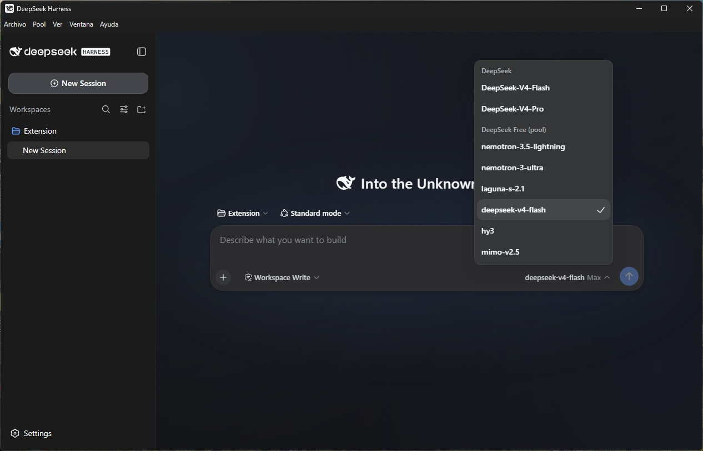

# FreeCode DeepSeek Harness

> Vibecoding en Windows con modelos OpenCode Free: abrí un proyecto, describí lo que querés construir y empezá.

[Read this in English](README.md)



## ¿Qué es FreeCode?

FreeCode es la aplicación de escritorio del DeepSeek Harness con un puente
OpenCode ya configurado. Su pool gratuito predeterminado usa modelos de
OpenCode Free. Te da un espacio local para programar con chat, archivos,
herramientas, sesiones y un navegador Chromium embebido con sesiones
persistentes.

No necesitás instalar Node, pnpm, Git, Python, OpenCode ni un servicio de
workers separado para usar la release de Windows.

## Empezá en tres pasos

1. Descargá el instalador de Windows o la AppImage de Linux desde la [release v0.2.3](https://github.com/Akunimal/free-code-deepseek-harness/releases/tag/v0.2.3).
2. Instalá FreeCode, abrilo y elegí la carpeta de tu proyecto.
3. Contale al modelo en lenguaje natural qué querés construir.

La release también incluye un `.exe` portable si no querés instalar. Para uso
diario conviene el instalador; el portable sirve para llevar la aplicación a
otra carpeta o máquina. En Linux, descargá la `.AppImage`, dale permisos de
ejecución (`chmod +x`) y ejecutala.

## Qué incluye

- Modelos OpenCode Free listos para usar, incluido `x-preview-f` cuando está disponible.
- Navegador Chromium persistente para investigar y usar computer use desde el
  navegador.
- Tool calling headless para el trabajo normal; sólo el selector de proyecto
  abre un selector visible cuando hace falta.
- Sesiones, workspaces, herramientas de archivos, permisos, planes, preguntas
  y toda la experiencia web upstream del Harness.
- Inglés, español y chino en la aplicación, incluidos los menús nativos y la
  bandeja.
- Fondos CSS animados con soporte para reducir el movimiento.
- Comprobación automática de actualizaciones, con una flecha de descarga junto a Configuración cuando hay una nueva versión.
- Compactado automático al 75% del contexto del modelo activo, también al cambiar a un modelo con menor contexto.
- Compresión opcional de salidas con RTK si ya tenés el ejecutable `rtk`; FreeCode nunca lo instala automáticamente.

## Algunos límites prácticos

La ruta OpenCode Free es compartida y puede tener límites upstream por
IP/sesión. Una respuesta puede tardar o fallar temporalmente. FreeCode conserva
la última selección válida, da más tiempo a las probes lentas de `x-preview-f` y
reintenta fallos de red transitorios. Más workers mejoran la concurrencia, pero
no crean más cuota.

## Actualización

FreeCode busca actualizaciones automáticamente. Cuando encuentra una, usá la
flecha de descarga junto a Configuración. Las releases se compilan y suben
manualmente, sin workflow de release de GitHub Actions, para no consumir la cuota
gratuita de CI. El checklist y las notas bilingües están en
[docs/RELEASE-POLICY.md](docs/RELEASE-POLICY.md).

## Para contribuir

```bash
pnpm install
pnpm build:vendor
pnpm build
pnpm test
pnpm test:contract
pnpm build:desktop
```

Más detalle en [la guía de arquitectura](docs/ARCHITECTURE.md),
[el inventario de funciones](docs/UPSTREAM-FEATURES.md),
[la guía de releases](docs/RELEASE.es.md) y
[las notas de UI](docs/UI.md), el [roadmap](docs/ROADMAP.md) y los
[problemas conocidos](docs/KNOWN-ISSUES.md).

## Proyecto

Este es el fork público [Akunimal/free-code-deepseek-harness](https://github.com/Akunimal/free-code-deepseek-harness)
de [deepseek-ai/deepseek-harness](https://github.com/deepseek-ai/deepseek-harness).
La rama de producto es `main` y la referencia upstream está en
`vendor/deepseek-harness`.

MIT — ver [LICENSE](LICENSE) y [NOTICE](NOTICE).

## Proyectos relacionados

FreeCode integra y se apoya en estos proyectos de código abierto:

- [OpenCode2API](https://github.com/jasonxu114514/opencode2api) — puente local compatible con OpenCode y pool de workers usado por la ruta de modelos gratuitos.
- [DeepSeek Harness](https://github.com/deepseek-ai/deepseek-harness) — harness upstream de agentes y runtime web basado en plugins.
- [RTK (Rust Token Killer)](https://github.com/rtk-ai/rtk) — compresor opcional de salidas CLI que puede reducir lo que llega al contexto del modelo.
- [Caveman](https://github.com/JuliusBrussee/caveman) — capa opcional candidata de compresión de respuestas/contexto en evaluación; FreeCode no la incluye ni la instala.

FreeCode no incluye, descarga ni instala RTK. Cuando el toggle de RTK está
habilitado y el ejecutable `rtk` ya está disponible, FreeCode envuelve sólo
comandos CLI simples elegibles; deja sin cambios los pipes, redirecciones,
sustituciones y demás sintaxis de shell. Si RTK no está instalado, se ejecuta
el comando original.
