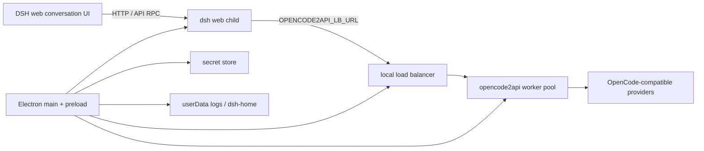

# Architecture

FreeCode DeepSeek Harness is an Electron shell around the upstream DeepSeek Harness web application. The shell owns local process lifecycle, provider wiring, secrets, model discovery, import/continuation helpers, packaging, and native desktop affordances. The upstream subtree owns the agent runtime and the conversation web product.



## Runtime sequence

1. Electron resolves a development resource root or packaged `resources/freecode`.
2. The shell starts the `opencode2api` pool and exposes a loopback load balancer.
3. The shell creates the non-sensitive `FREECODE_PUBLIC_KEY=public` vault default when no user key exists. `dsh web --host 127.0.0.1 --port 0` then starts with `OPENCODE2API_LB_URL` and the resolved secret environment; the pool forwards `Bearer public` to OpenCode's free catalog.
4. The supervisor waits for the upstream readiness URL and opens a hardened `BrowserWindow` with context isolation, no Node integration, sandboxing, and the preload bridge.
5. Provider seeding writes a schema-compatible `deepseek-free` route. Model refresh probes every visible model and keeps the catalog plus `settings.yaml` synchronized without deleting user providers.
6. The browser talks to the harness web server. The shell does not reimplement upstream conversation rendering; it packages the upstream UI and applies the lightweight per-conversation CSS motion layer in `ui-conversation`.

## Process ownership

- `apps/shell/src/main/index.ts`: Electron lifecycle, window, tray, menu, overlay, notifications, updates, and logging.
- `apps/shell/src/main/runtime.ts`: composition of pool, load balancer, and harness supervisor.
- `apps/shell/src/main/harness-supervisor.ts`: readiness, stop, restart, backoff, and restart budget for `dsh web`.
- `packages/opencode-adapter`: worker spawn, health checks, respawn budget, round-robin selection, sticky session routing, SSE proxying.
- `packages/shared-types`: zod-backed IPC and chat interchange contracts.
- `packages/chat-importer`: OpenCode SQLite and ChatML conversion into `InterchangeChat`.
- `packages/workspace-bridge`: import/continuation routing into an existing OpenCode workspace.
- `vendor/deepseek-harness`: upstream runtime and web client, vendored as a subtree.

## Resource layouts

Development uses `apps/shell/resources/opencode2api/*` and the source tree under `vendor/deepseek-harness`. A packaged build uses:

```text
resources/freecode/
  opencode2api/<platform-binary>
  dsh/apps/cli/lib/bin.js
  dsh/packages/**/node_modules/@deepseek-ai/*  # workspace links
  runtime-manifest.json
```

The complete workspace install is deliberate. A production-only pnpm install leaves upstream workspace links unresolved and causes boot failures.

## Security boundaries

- The renderer receives only `window.freecode` from preload.
- Secrets are read from the host vault and injected into child process environments; they are not written into `process.env` by the resolver.
- All local services bind to `127.0.0.1`.
- The updater is disabled unless `FREECODE_ENABLE_UPDATES=1`.
- The web harness remains responsible for upstream permission, sandbox, filesystem, and tool policies.

## Portable pool controls

The pool exposes a live 1..16 worker-slot setting through the desktop overlay and typed preload IPC. The default is four. A slot is a local `opencode2api` process, not a newly provisioned OpenCode account: the public route uses the same `Bearer public` identity and remains subject to upstream quota and IP-based rate limits. The slider changes concurrency only; it cannot bypass those limits.

Windows portable builds receive `PORTABLE_EXECUTABLE_DIR` from electron-builder and place `data/` beside the executable. `FREECODE_PORTABLE_DIR` can be used by a manually launched packaged app to select the same behavior. The binaries, Electron runtime, upstream CLI, web app, and native dependencies are packaged together so the user does not need a developer toolchain.

The permission boundary is intentionally inherited from upstream: approvals, permission presets, sandbox modes, filesystem policy, tool confirmations, and escalation remain the DeepSeek Harness contracts. The shell's Electron sandbox protects the renderer but does not silently alter agent permissions.
